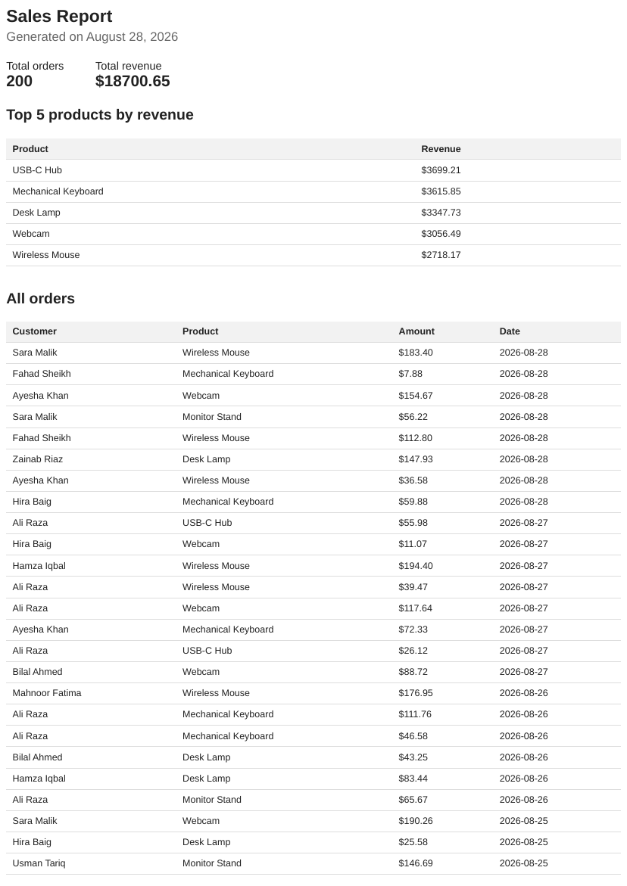

# PDF Report Generator

FlyRank Internship, Backend Track, Week 4, Assignment A8.

This is a small sales reporting API. It seeds a SQLite database with fake orders, aggregates
them with SQL, renders the numbers into an HTML page, and prints that page to a real PDF
with a headless browser. Generation runs as a background job so the client gets an
instant response instead of waiting a few seconds for Playwright to finish.

I went with **Option A, the little shop**, not the bookstore option, since I wanted this one
to stand on its own without depending on the A9 scraper output.

## Stack

- Python 3.10+
- FastAPI + Uvicorn
- SQLite (built-in `sqlite3` module)
- Playwright (Chromium) for HTML to PDF

## How to run it

```bash
pip install -r requirements.txt
playwright install chromium

# seed the database (safe to run more than once, it wipes and reseeds)
python seed.py

# start the API
uvicorn app:app --reload
```

Server comes up on `http://127.0.0.1:8000`.

## Endpoints

| Method | Path | What it does |
|---|---|---|
| GET | `/health` | `{"status": "ok"}` |
| POST | `/reports` | Kicks off report generation as a background job. Returns `202` right away with `{id, status: "pending", file}`. Pass `{"force": true}` to skip the once-a-day check. |
| GET | `/reports/{id}` | Current status of that report (`pending` or `done`), 404 if the id doesn't exist. |
| GET | `/reports/{id}/file` | Downloads the finished PDF. `409` if it's still generating. |

## The aggregation query

Four things come out of `queries.py`, all from one `get_report_data()` call:

```sql
SELECT COUNT(*) AS total FROM orders;

SELECT SUM(amount) AS total FROM orders;

SELECT product, SUM(amount) AS revenue
FROM orders
GROUP BY product
ORDER BY revenue DESC
LIMIT 5;

SELECT created_at AS day, COUNT(*) AS orders
FROM orders
WHERE created_at >= ?
GROUP BY created_at
ORDER BY created_at;
```

## Proof it works

```
$ curl -i -X POST http://127.0.0.1:8000/reports
HTTP/1.1 202 Accepted
{"id":1,"status":"pending","file":"/reports/1/file"}

$ curl -o my-report.pdf http://127.0.0.1:8000/reports/1/file
# opens as a real, multi-page PDF
```

Duplicate request proof — same day, two POSTs back to back, one file on disk:

```
$ ./demo_idempotency.sh
First POST:
{"id":1,"status":"pending","file":"/reports/1/file"}

Second POST (same day, no force):
{"id":1,"status":"done","file":"/reports/1/file"}

Force a new one:
{"id":2,"status":"pending","file":"/reports/2/file"}
```

Only one PDF landed in `reports/` from the first two calls, `force: true` is what
made a second one.

## Stage 4 note — why background job, and what it costs

I moved generation out of the request from the start instead of doing it inline first.
`POST /reports` inserts a `pending` row and hands the actual query + render + save
off to a `BackgroundTasks` job, so the response comes back in milliseconds no matter
how long Playwright takes. The tradeoff is the client can't just download the file off
the POST response anymore, it has to poll `GET /reports/{id}` until `status` flips to
`done`. For a bigger report or a lot of concurrent users I'd move this to a real queue
(Redis + a worker, or Inngest) instead of an in-process background task, since
`BackgroundTasks` still dies if the server restarts mid-job.

## Stage 5 note — what the once-a-day check protects against

It stops a double-click, or a retried request after a flaky connection, from spinning
up the same report twice. A real-world version of the same bug: a billing job that
fires an invoice email on every retry instead of checking "did this customer already
get today's invoice" first, that's how customers end up charged, or emailed, twice.

## Screenshot

Page 1 of a generated report:



## Notes

- `reports/*.pdf` and `report.db` are gitignored, they're generated, not source.
- Run `seed.py` again any time, it deletes existing rows first so the count doesn't
  double.
